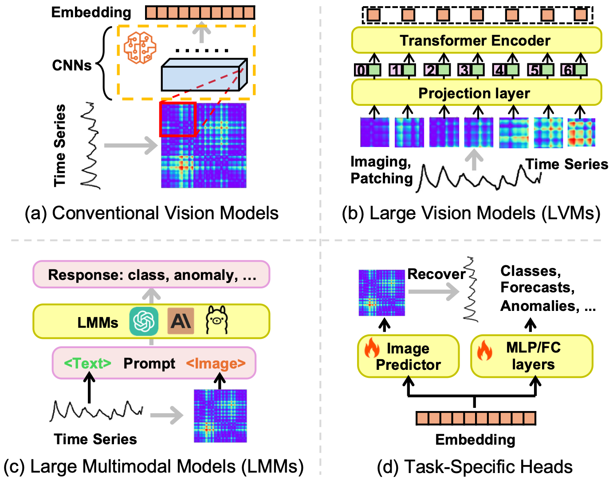

<div align="center">


# Awesome Vision Models for Time Series Analysis
[](https://awesome.re)

[](https://www.arxiv.org/abs/2502.08869)
[](#package)
[](https://badges.pufler.dev/visits/D2I-Group/awesome-vision-time-series)
</div>


This repository tracks the latest paper on Vision Models for Time series Analysis and serves as the official repository for [Harnessing Vision Models for Time Series Analysis: A Survey](https://www.arxiv.org/abs/2502.08869). This repository is actively maintained by **D2I Group@UH**. We will update our reposititory and survey regularly.

<p align="center">
    🏆&nbsp;<a href="#contribution">Contribution</a>
    | 📌&nbsp;<a href="#taxonomy">Taxonomy</a>
    | ⚙️&nbsp;<a href="#package">Package</a>
    | 🔗&nbsp;<a href="#citation">Citation</a>
</p>


***

### Contribution

Time series analysis has witnessed the inspiring development from traditional autoregressive models, deep learning models, to recent Transformers and Large Language Models (LLMs). Efforts in leveraging vision models for time series analysis have also been made along the way but are less visible to the community due to the predominant research on sequence modeling in this domain. However, the discrepancy between continuous time series and the discrete token space of LLMs, and the challenges in explicitly modeling the correlations of variates in multivariate time series have shifted some research attentions to the equally successful Large Vision Models (LVMs) and Vision Language Models (VLMs). To fill the blank in the existing literature, this survey discusses the advantages of vision models over LLMs in time series analysis and provides a comprehensive and in-depth overview of the existing methods.

<div align="center">


|[](./fig/structure.png)|
|:--:| 
|Figure 1: The general process of leveraging vision models for time series analysis|
</div>


<div align="center">


|[](./fig/image_plot.png)|
|:--:| 
|Figure 2: Image Transformation of Time Series|
</div>


<div align="center">

|[](./fig/Pipeline.png)|
|:--:| 
|Figure 3: Illustration of different modeling strategies on imaged time series |
</div>


The overall structure of our survey follows the general process of applying vision models for time series analysis as delineated in Figure 1. Based on the proposed dual view taxonomy, primary imaging methods on time series in Figure 2 and imaged modelling solutions in Figure 3, are reviewed in this survey, followed by the discussion including pre- & post-processing involved in this framework and future directions in this promising field.

***
### Taxonomy
Taxonomy are proposed as a dual view of *Time Series to Image Transformation* and *Imaged Time Series Modeling*. For the former, primary methods for imaging UTS or MTS are described and remarked on their pros and cons. For the latter, the existing methods are classified by conventional vision models, Large Vision Models (LVMs) and Large Multimodal Models (LMMs).

#### Image Transformation of Time Series

* **Line Plot**
    - (Finance) Trading via image classification [[paper](https://arxiv.org/abs/1907.10046)]
    - (Finance) Visual time series forecasting: an image-driven approach [[paper](https://arxiv.org/abs/2011.09052)]
    - (Physics) Classification of time series as images using deep convolutional neural networks: application to glitches in gravitational wave data [[paper](https://par.nsf.gov/servlets/purl/10411304)]
    - (General) Image-based time series forecasting: A deep convolutional neural network approach [[paper](https://www.sciencedirect.com/science/article/abs/pii/S0893608022003902)]
    - (General) Time series as images: Vision transformer for irregularly sampled time series [[paper](https://arxiv.org/abs/2303.12799)][[code](https://github.com/Leezekun/ViTST)]
    - (General) Your time series is worth a binary image: machine vision assisted deep framework for time series forecasting [[paper](https://arxiv.org/abs/2302.14390)][[code](https://github.com/IkeYang/machine-vision-assisted-deep-time-series-analysis-MV-DTSA-)]
    - (General) ViTime: A visual intelligence-based foundation model for time series forecasting [[paper](https://arxiv.org/abs/2407.07311)][[code]](https://github.com/IkeYang/ViTime)
    - (General) Insight miner: A time series analysis dataset for cross-domain alignment with natural language [[paper](https://openreview.net/pdf?id=E1khscdUdH)]
    - (Finance) Leveraging vision-language models for granular market change prediction [[paper](https://arxiv.org/abs/2301.10166)]
    - (General) Plots unlock time-series understanding in multimodal models [[paper](https://arxiv.org/abs/2410.02637)]
    - (General) See it, think it, sorted: Large multimodal models are few-shot time series anomaly analyzers [[paper](https://arxiv.org/abs/2411.02465)]
    - (General) On the feasibility of vision-language models for time-series classification [[paper](https://arxiv.org/abs/2412.17304)][[code](https://github.com/vinayp17/VLM_TSC)]


* **Heatmap**
    - (Traffic) Learning Traffic as Images: A Deep Convolutional Neural Network for Large-scale Transportation Network Speed Prediction [[paper](https://arxiv.org/abs/1701.04245)]
    - (General) Multivariate time series classification using dilated convolutional neural network [[paper](https://arxiv.org/abs/1905.01697)][[code](https://github.com/SonbolYb/multivariate_timeseries_dilated_conv)]
    - (Finance) Deep video prediction for time series forecasting [[paper](https://arxiv.org/abs/2102.12061)]
    - (Health) TTS-GAN: A transformer-based time-series generative adversarial network [[paper](https://arxiv.org/abs/2202.02691)][[code](https://github.com/imics-lab/tts-gan)]
    - (General) TimesNet: Temporal 2d-variation modeling for general time series analysis [[paper](https://arxiv.org/abs/2210.02186)][[code](https://github.com/thuml/TimesNet)]
    - (Health) TimEHR: Image-based time series generation for electronic health records [[paper](https://arxiv.org/abs/2402.06318)][[code](https://github.com/esl-epfl/TimEHR)]
    - (General) VisionTS: Visual masked autoencoders are free-lunch zero-shot time series forecasters [[paper](https://arxiv.org/abs/2408.17253)][[code](https://github.com/Keytoyze/VisionTS)]


* **Spectrogram**
    - (Audio) AST: Audio spectrogram transformer [[paper](https://arxiv.org/abs/2104.01778)][[code](https://github.com/YuanGongND/ast)]
    - (Audio) SSAST: Self-supervised audio spectrogram transformer [[paper](https://arxiv.org/abs/2110.09784)][[code](https://github.com/YuanGongND/ssast)]
    - (Audio) MAE-AST: Masked autoencoding audio spectrogram transformer [[paper](https://arxiv.org/abs/2203.16691)][[code](https://github.com/AlanBaade/MAE-AST-Public)]
    - (Audio) AST-SED: An effective sound event detection method based on audio spectrogram transformer [[paper](https://arxiv.org/abs/2303.03689)]
    - (Finance) From pixels to predictions: Spectrogram and vision transformer for better time series forecasting [[paper](https://arxiv.org/abs/2403.11047)]
    - (General) Training-free time-series anomaly detection: Leveraging image foundation models [[paper](https://arxiv.org/abs/2408.14756)]
    - (Audio) Vision language models are few-shot audio spectrogram classifiers [[paper](https://arxiv.org/abs/2411.12058)]

* **Gramian Angular Field**
    - (General) Encoding Time Series as Images for Visual Inspection and Classification Using Tiled Convolutional Neural Networks [[paper](https://coral-lab.umbc.edu/wp-content/uploads/2015/05/10179-43348-1-SM1.pdf)]
    - (Genearl) Imaging Time-series to Improve Classification and Imputation [[paper](https://arxiv.org/abs/1506.00327)]
    - (Finance) Deep learning and time series-to-image encoding for financial forecasting [[paper](https://ieeexplore.ieee.org/document/9080613)]
    - (Sensing) Multi-sensor data fusion and time series to image encoding for hardness recognition [[paper](https://ieeexplore.ieee.org/document/10600105)]

* **Recurrence Plot**
    - (General) Time Series Classification Using Compression Distance of Recurrence [[paper](https://ieeexplore.ieee.org/document/6729553)]
    - (General) Classification of Time-series Images using Deep Convolutional Neural Networks [[paper](https://arxiv.org/abs/1710.00886)]
    - (General) Forecasting with Time Series Imaging [[paper](https://arxiv.org/abs/1904.08064)][[code](https://github.com/lixixibj/forecasting-with-time-series-imaging)]
    - (General) Hierarchical context representation and self-adaptive thresholding for multivariate anomaly detection [[paper](https://ieeexplore.ieee.org/document/10417809)]
    - (General) CAFO: Feature-centric explanation on time series classification [[paper](https://arxiv.org/abs/2406.01833)][[code](https://github.com/eai-lab/CAFO)]

* **Other Methods**
    - (General) A Deep Neural Network for unsupervised anomaly detection and diagnosis in multivariate time series data [[paper](https://dl.acm.org/doi/10.1609/aaai.v33i01.33011409)][[code](https://github.com/7fantasysz/MSCRED)]
    - (General) Fusion of image representations for time series classification with deep learning [[paper](https://link.springer.com/chapter/10.1007/978-3-031-72347-6_16)][[code](https://sites.google.com/view/firts-paper)]
    - (General) Utilizing image transforms and diffusion models for generative modeling of short and long time series [[paper](https://arxiv.org/abs/2410.19538)][[code]](https://github.com/azencot-group/ImagenTime)


<sub>TS-Recover denotes recovering time series from predicted images. </sub> $*$<sub>: the method has been used to model the individual UTSs of an MTS. </sub>$^{\natural}$ <sub>: a new pre-trained model was proposed in the work. </sub>$^{\flat}$ : <sub>when pre-trained models were unused, Fine-tune refers to train a task-specific model from scratch. </sub>

Method|TS-Type|Imaging|Multimodal|Model|Pre-trained|Fine-tune|Prompt|TS-Recover|Task|Domain|Code
:-----|:---------:|:---:|:---:|:---:|:---:|:---:|:---:|:---:|:---:|:--:|:--:
[Silva et al., 2013](https://ieeexplore.ieee.org/document/6729553)|UTS|RP|✘|K-NN|✘|✘|✘|✘|Classification|General|✘
[Wang and Oates, 2015a](https://coral-lab.umbc.edu/wp-content/uploads/2015/05/10179-43348-1-SM1.pdf) |UTS|GAF|✘|CNN|✘|$✔^\flat$|✘|$✔$|Classification|General|✘
[Wang and Oates, 2015b](https://arxiv.org/abs/1506.00327) |UTS|GAF|✘|CNN|✘|$✔^\flat$|✘|$✔$|Classification & Imputation|General|✘
[Ma et al., 2017](https://arxiv.org/abs/1701.04245) |MTS|Heatmap|✘|CNN|✘|$✔^\flat$|✘|$✔$|Forecasting|Traffic|✘
[Hatami et al., 2018](https://arxiv.org/abs/1710.00886) |UTS|RP|✘|CNN|✘|$✔^\flat$|✘|✘|Classification|General|✘
[Yazdanbakhsh and Dick, 2019](https://arxiv.org/abs/1905.01697)|MTS|Heatmap|✘|CNN|✘|$✔^\flat$|✘|✘|Classification|General|[✔](https://github.com/SonbolYb/multivariate_timeseries_dilated_conv)
[MSCRED](https://dl.acm.org/doi/10.1609/aaai.v33i01.33011409) |MTS|Other|✘|ConvLSTM|✘|$✔^\flat$|✘|✘|Anomaly|General|[✔](https://github.com/7fantasysz/MSCRED)
[Li et al., 2020](https://arxiv.org/abs/1904.08064)|UTS|RP|✘|CNN|$✔$|$✔$|✘|✘|Forecasting|General|[✔](https://github.com/lixixibj/forecasting-with-time-series-imaging)
[Cohen et al., 2020](https://arxiv.org/abs/1907.10046) |UTS|LinePlot|✘|Ensemble|✘|$✔^\flat$|✘|✘|Classification|Finance|✘
[Barra et al., 2020](https://ieeexplore.ieee.org/document/9080613) |UTS|GAF|✘|CNN|✘|$✔^\flat$|✘|✘|Classification|Finance|✘
[VisualAE](https://arxiv.org/abs/2011.09052) |UTS|LinePlot|✘|CNN|✘|$✔^\flat$|✘|$✔$|Forecasting|Finance|✘
[Zeng et al., 2021](https://arxiv.org/abs/2102.12061) |MTS|Heatmap|✘|CNN, LSTM|✘|$✔^\flat$|✘|$✔$|Forecasting|Finance|✘
[AST](https://arxiv.org/abs/2104.01778) |UTS|Spectrogram|✘|DeiT|$✔$|$✔$|✘|✘|Classification|Audio|[✔](https://github.com/YuanGongND/ast)
[TTS-GAN](https://arxiv.org/abs/2202.02691)| MTS|Heatmap|✘|ViT|✘|$✔^\flat$|✘|$✔$|Ts-Generation|Health|[✔](https://github.com/imics-lab/tts-gan)
[SSAST](https://arxiv.org/abs/2110.09784) |UTS|Spectrogram|✘|ViT|$✔^\natural$|$✔$|✘|✘|Classification|Audio|[✔](https://github.com/YuanGongND/ssast)
[MAE-AST](https://arxiv.org/abs/2203.16691) |UTS|Spectrogram|✘|MAE|$✔^\natural$|$✔$|✘|✘|Classification|Audio|[✔](https://github.com/AlanBaade/MAE-AST-Public)
[AST-SED](https://arxiv.org/abs/2303.03689) |UTS|Spectrogram|✘|SSAST, GRU|$✔$|$✔$|✘|✘|EventDetection|Audio|✘
[Jin et al., 2023](https://par.nsf.gov/servlets/purl/10411304) |UTS|LinePlot|✘|CNN|$✔$|$✔$|✘|✘|Classification|Physics|✘
[ForCNN](https://www.sciencedirect.com/science/article/abs/pii/S0893608022003902) |UTS|LinePlot|✘|CNN|✘|$✔^\flat$|✘|✘|Forecasting|General|✘
[Vit-num-spec](https://arxiv.org/abs/2403.11047) |UTS|Spectrogram|✘|ViT|✘|$✔^\flat$|✘|✘|Forecasting|Finance|✘
[ViTST](https://arxiv.org/abs/2303.12799) |MTS|LinePlot|✘|Swin|$✔$|$✔$|✘|✘|Classification|General|[✔](https://github.com/Leezekun/ViTST)
[MV-DTSA](https://arxiv.org/abs/2302.14390)|UTS*|LinePlot|✘|CNN|✘|$✔^\flat$|✘|$✔$|Forecasting|General|[✔](https://github.com/IkeYang/machine-vision-assisted-deep-time-series-analysis-MV-DTSA-)
[TimesNet](https://arxiv.org/abs/2210.02186) |MTS|Heatmap|✘|CNN|✘|$✔^\flat$|✘|$✔$|Multiple|General|[✔](https://github.com/thuml/TimesNet)
[ITF-TAD](https://arxiv.org/abs/2408.14756)|UTS|Spectrogram|✘|CNN|$✔$|✘|✘|✘|Anomaly|General|✘
[Kaewrakmuk et al., 2024](https://ieeexplore.ieee.org/document/10600105)|UTS|GAF|✘|CNN|$✔$|$✔$|✘|✘|Classification|Sensing|✘
[HCR-AdaAD](https://ieeexplore.ieee.org/document/10417809) |MTS|RP|✘|CNN, GNN|✘|$✔^\flat$|✘|✘|Anomaly|General|✘
[FIRTS](https://link.springer.com/chapter/10.1007/978-3-031-72347-6_16) |UTS|Other|✘|CNN|✘|$✔^\flat$|✘|✘|Classification|General|[✔](https://sites.google.com/view/firts-paper)
[CAFO](https://arxiv.org/abs/2406.01833) |MTS|RP|✘|CNN, ViT|✘|$✔^\flat$|✘|✘|Explanation|General|[✔](https://github.com/eai-lab/CAFO)
[ViTime](https://arxiv.org/abs/2407.07311) |UTS*|LinePlot|✘|ViT|$✔^\natural$|$✔$|✘|$✔$|Forecasting|General|[✔](https://github.com/IkeYang/ViTime)
[ImagenTime](https://arxiv.org/abs/2410.19538) |MTS|Other|✘|CNN|✘|$✔^\flat$|✘|$✔$|Ts-Generation|General|[✔](https://github.com/azencot-group/ImagenTime)
[TimEHR](https://arxiv.org/abs/2402.06318) |MTS|Heapmap|✘|CNN|✘|$✔^\flat$|✘|$✔$|Ts-Generation|Health|[✔](https://github.com/esl-epfl/TimEHR)
 [VisionTS](https://arxiv.org/abs/2408.17253) |UTS*|Heatmap|✘|MAE|$✔$|$✔$|✘|$✔$|Forecasting|General|[✔](https://github.com/Keytoyze/VisionTS)
[InsightMiner](https://openreview.net/pdf?id=E1khscdUdH) |UTS|LinePlot|$✔$|LLaVA|$✔$|$✔$|$✔$|✘|Txt-Generation|General|✘
[Wimmer and Rekabsaz, 2023](https://arxiv.org/abs/2301.10166) |MTS|LinePlot|$✔$|CLIP, LSTM|$✔$|$✔$|✘|✘|Classification|Finance|✘
[Dixit et al., 2024](https://arxiv.org/abs/2411.12058) |UTS|Spectrogram|$✔$|GPT4o, Gemini & Claude3|$✔$|✘|$✔$|✘|Classification|Audio|✘
[Daswani et al., 2024](https://arxiv.org/abs/2410.02637) |MTS|LinePlot|$✔$|GPT4o, Gemini|$✔$|✘|$✔$|✘|Multiple|General|✘
[TAMA](https://arxiv.org/abs/2411.02465) |UTS|LinePlot|$✔$|GPT4o|$✔$|✘|$✔$|✘|Anomaly|General|✘
[Prithyani et al., 2024](https://arxiv.org/abs/2412.17304) |MTS|LinePlot|$✔$|LLaVA|$✔$|$✔$|$✔$|✘|Classification|General|[✔](https://github.com/vinayp17/VLM_TSC)


***
### Package

We have uploaded our code to package to PyPI, run the following command for installation.

```bash
pip install time2img
```

Our code compatible with all common benchmarks found in [Google Drive](https://drive.google.com/drive/folders/1ZOYpTUa82_jCcxIdTmyr0LXQfvaM9vIy). You can run [example](./src/main.py) to reproduce our illustration of different time series imaging methods (Figure 2) from our paper. 


***
### Citation

```
@article{ni2025harnessing,
  title={Harnessing Vision Models for Time Series Analysis: A Survey},
  author={Ni, Jingchao and Zhao, Ziming and Shen, ChengAo and Tong, Hanghang and Song, Dongjin and Cheng, Wei and Luo, Dongsheng and Chen, Haifeng},
  journal={arXiv preprint arXiv:2502.08869},
  year={2025}
}
```

